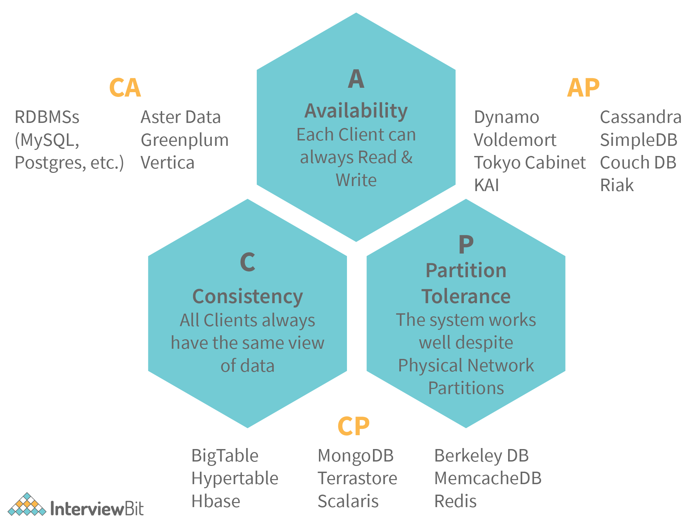

## System Design
[for Freshers] 1. What is CAP theorem?
Answer

CAP theorem says that a distributed system cannot guarantee C, A and P simultaneously.

Consistency: This states that the data has to remain consistent after the execution of an operation in the database.
Availability: The databases cannot have downtime and should be available and responsive always.
Partition Tolerance: The database system should be functioning despite the communication becoming unstable.

e.g.
・RDBMS databases guarantee Consistency and Availability simultaneously.
・Redis, MongoDB, Hbase databases guarantee Consistency and Partition Tolerance.
・Cassandra, CouchDB guarantees Availability and Partition Tolerance.
CAP(Consistency-Availability-Partition Tolerance) theorem says that a distributed system cannot guarantee C, A and P simultaneously. It can at max provide any 2 of the 3 guarantees. Let us understand this with the help of a distributed database system.
Consistency: This states that the data has to remain consistent after the execution of an operation in the database. For example, post database updation, all queries should retrieve the same result.
Availability: The databases cannot have downtime and should be available and responsive always.
Partition Tolerance: The database system should be functioning despite the communication becoming unstable.
The following image represents what databases guarantee what aspects of the CAP Theorem simultaneously. We see that RDBMS databases guarantee consistency and Availability simultaneously. Redis, MongoDB, Hbase databases guarantee Consistency and Partition Tolerance. Cassandra, CouchDB guarantees Availability and Partition Tolerance.

